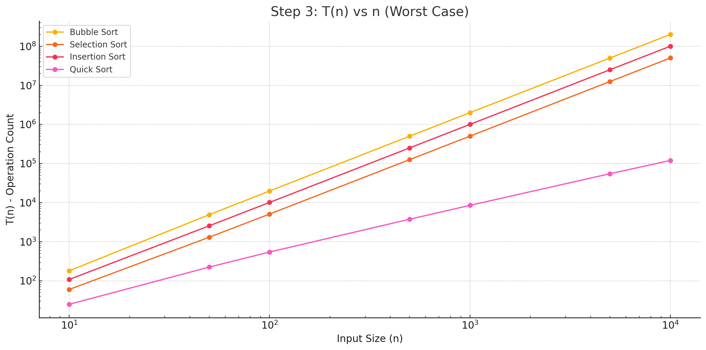

## step 3
Use the sort functions with the T(n) calculation feature to plot T(n) vs. n for a wide range of list sizes. Say 10, 50, 100, 500, 1000, 5000, 10000, 50000, 100000, 1000000, 10000000. Make sure you use the WORST CASE scenario for your list so that your T(n) reflects O(n) well. Do you see your curves aligned with what we learnt about the performance of the sort algorithms?

A: Yes. It shows what I learnt about the performance of the sort algorithm

